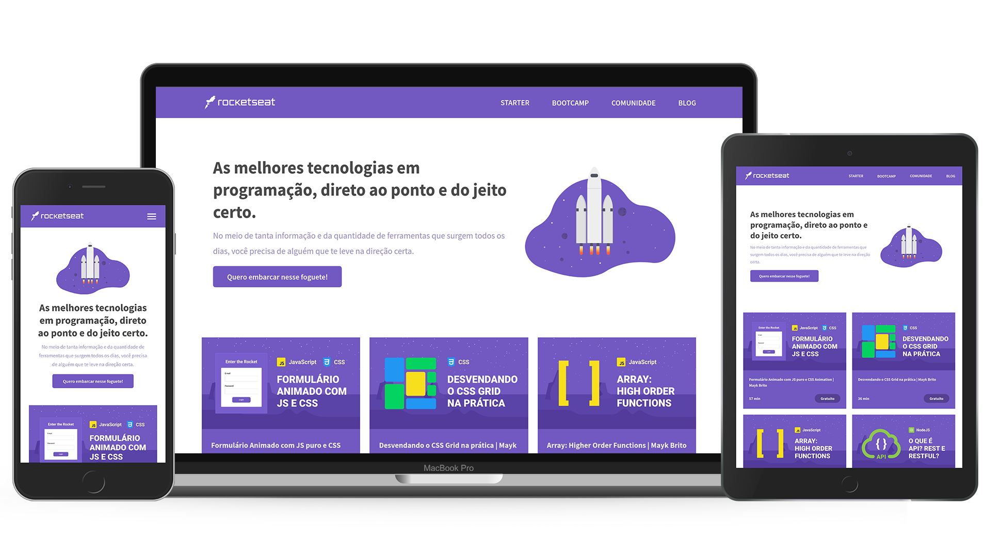

<h1 align="center">
    Responsiveness
</h1>

<p align="center">Develop a responsive landing page</p>

<p align="center">

<a href="https://github.com/diego-aquino">

</a>


<a>

</a>

<a href="./LICENSE">

</a>


</p>

<p align="center">
<a href="#rocket-features">Features</a>&nbsp;&nbsp;&nbsp;|&nbsp;&nbsp;&nbsp;
<a href="#gear-technologies">Technologies</a>&nbsp;&nbsp;&nbsp;|&nbsp;&nbsp;&nbsp;
<a href="#computer-try-it">Try it</a>&nbsp;&nbsp;&nbsp;|&nbsp;&nbsp;&nbsp;
<a href="#newspaper_roll-license">License</a>
</p>



> Inspired by the landing page of [Rocketseat](https://rocketseat.com.br/)

## :rocket: Features

- Adaptive layout to different devices
  - Responsive navbar
  - Device-friendly hero
  - Flexible video showcase
  - Adaptive form
- Video previews (showed when a video card is clicked)
- Overall animations and transitions

## :gear: Technologies

The main technologies used in this project are the following:

- [JavaScript](https://developer.mozilla.org/en-US/docs/Web/JavaScript) + [HTML](https://developer.mozilla.org/en-US/docs/Web/HTML) + [CSS](https://developer.mozilla.org/en-US/docs/Web/CSS)

## :computer: Try it

To clone and run this application, you'll need [Git](https://git-scm.com/) and [Node.js](https://nodejs.org/en/) installed on your computer. Then, from your command line:

```bash
# clone and access this repository
$ git clone https://github.com/diego-aquino/responsiveness.git
$ cd responsiveness/

# to start a local server, you can use the http-server package
$ npm install --global http-server

# start a local server
$ http-server
```

Now you can visit `http://localhost:8080` to check this project out!

## :newspaper_roll: License

This project if under MIT License. Check [LICENSE](./LICENSE) for more information.

---

Made by [Diego Aquino](https://github.com/diego-aquino/) :sunglasses:. [Connect with me!](https://www.linkedin.com/in/diego-aquino) :wave:
